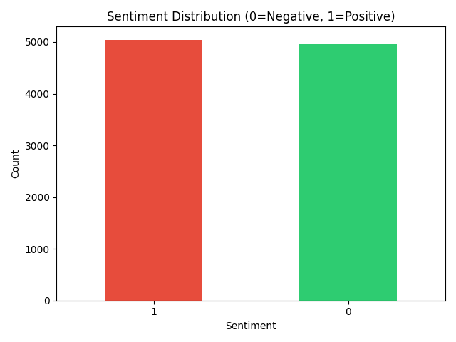
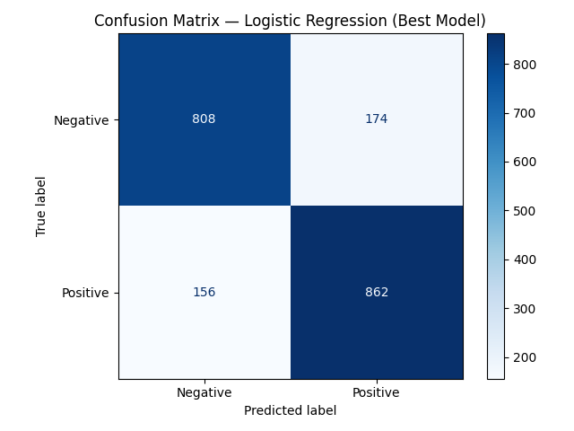

# Sentiment Analysis on Amazon Product Reviews

Binary sentiment classifier trained on 10,000 Amazon product reviews to predict Positive or Negative sentiment.

## Tech Stack
Python, Scikit-learn, Pandas, NumPy, Matplotlib, Seaborn

## Models Compared

| Model | Accuracy |
|---|---|
| Logistic Regression | 83.50% |
| SVM | 81.85% |
| Naive Bayes | 80.60% |

## ML Pipeline
1. Loaded 10,000 samples from 4M Amazon reviews dataset
2. EDA — class balance check and review length analysis
3. Text preprocessing — lowercasing, punctuation removal
4. TF-IDF vectorization (5000 features)
5. Trained and compared 3 classification models
6. Evaluated using Accuracy, Precision, Recall, F1-Score

## Results
Logistic Regression performed best at 83.50% accuracy with balanced precision and recall across both classes.

## Visualizations



## How to Run
```bash
pip install pandas numpy scikit-learn matplotlib seaborn jupyter
jupyter notebook sentiment_analysis.ipynb
```
